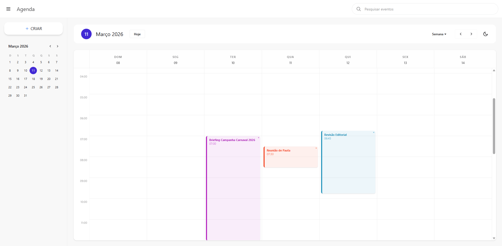

# Agenda — Aplicativo de Calendário

Aplicativo web de calendário e agenda, com visualização por dia, semana e mês, criação e edição de eventos, pesquisa e integração com API.



## Sobre o projeto

O **Agenda** é uma aplicação de calendário moderna que permite gerenciar compromissos e eventos. A interface é dividida em:

- **Barra lateral:** Navegação, mini-calendário e botão para criar novos eventos.
- **Cabeçalho:** Pesquisa de eventos, seletor de visualização (Dia, Semana, Mês), navegação entre períodos e alternância de tema.
- **Área principal:** Grade de horários com os eventos da semana (ou do dia/mês), com possibilidade de arrastar e redimensionar.

## Funcionalidades

- **Visualizações:** Dia, Semana e Mês.
- **Eventos:** Criar, editar e excluir eventos com título, descrição, data/hora e cor.
- **Pesquisa:** Buscar eventos pelo texto.
- **Mini-calendário:** Navegação rápida por mês na sidebar.
- **Arrastar e redimensionar:** Alterar data/hora dos eventos arrastando na grade (com confirmação).
- **Tema:** Suporte a modo claro/escuro.
- **API:** Consumo de API REST para persistência dos eventos.

## Tecnologias

- **SvelteKit** — Framework full-stack
- **Svelte 5** — Reactividade com runes
- **TypeScript** — Tipagem estática
- **Tailwind CSS** — Estilização
- **DaisyUI** — Componentes e temas
- **Vite** — Build e dev server
- **Playwright** — Testes E2E

## Pré-requisitos

- Node.js (recomendado LTS)
- npm ou pnpm

## Como rodar

### Instalação

```bash
npm install
```

### Desenvolvimento

```bash
npm run dev
```

A aplicação estará disponível em `http://localhost:5173` (ou na porta indicada no terminal).

### Build para produção

```bash
npm run build
```

### Preview do build

```bash
npm run preview
```

## Testes

```bash
npm run test
```

Executa os testes E2E com Playwright.

## Estrutura do projeto (resumo)

```
src/
├── lib/
│   ├── api/          # Cliente e API de eventos
│   ├── components/   # Componentes (calendário, modais, UI)
│   ├── stores/       # Estado global (calendário)
│   ├── types/        # Tipos TypeScript
│   └── utils/        # Utilitários (datas, etc.)
├── routes/           # Páginas SvelteKit
└── app.html
docs/                 # Documentação e imagens
```

## Configuração da API

A aplicação espera uma API REST de eventos. Configure a URL base no cliente em `src/lib/api/client.ts` (ou via variáveis de ambiente) para apontar ao seu backend.

## Licença

Projeto privado.
